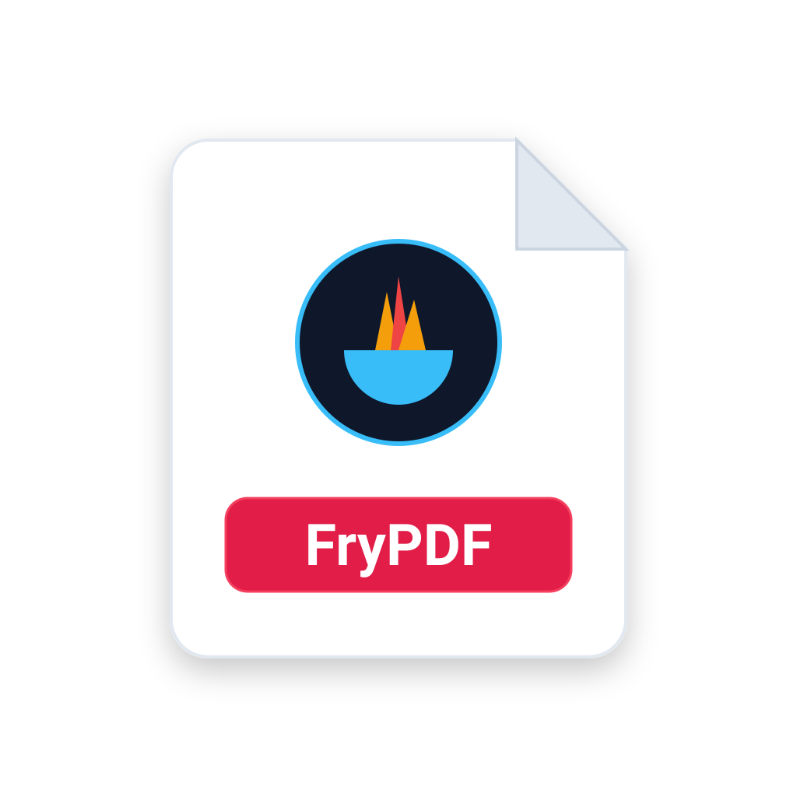

# FryPDF

<div align="center">



### Privacy-First, Professional Desktop PDF Creator & Editor
*Built with .NET 10, Avalonia UI, QuestPDF, SkiaSharp & Modular Microkernel Plugins.*

[](https://dotnet.microsoft.com/)
[](https://avaloniaui.net/)
[](https://www.questpdf.com/)
[](https://github.com/CodeFryDev/FryPDF)
[](tests/PdfEditorApp.Tests)
[](LICENSE)

</div>

---

## ✨ Features

- 🧩 **Modular Plugin System** — Microkernel architecture where tools, ribbons, sidebars, and canvas elements are dynamic, extensible plugins. Supports third-party `.fryplugin` packages.
- 📕 **Dedicated Reader Mode** — Continuous scroll, book spreads, page thumbnails, TOC bookmarks, search, and annotation highlights/stamps.
- 📖 **PDF Deconstruction Engine** — Ingest and convert existing PDFs into editable vector canvas elements with layered Z-index ordering.
- 📝 **AcroForms & Signatures** — Interactive form fields with formula recalculation, plus freehand and cursive vector signatures.
- 📊 **Vector Charts & Math** — 13+ dynamic vector chart varieties and LaTeX mathematical formula typesetting.
- 🤖 **Offline AI & Local OCR** — On-device LLM assistant (Ollama) and local Tesseract OCR text extraction without cloud uploads.
- 🛠️ **32 Dedicated PDF Tools** — Complete offline toolset for merging, splitting, compressing, watermarking, redacting, and converting.

---

## 🚀 Quick Start

**Prerequisite**: [.NET 10 SDK](https://dotnet.microsoft.com/download/dotnet/10.0)

```bash
# Build
dotnet build

# Test
dotnet test

# Run
./run
# or: dotnet run --project src/PdfEditorApp
```

---

## 📦 Downloads & Packaging

- **macOS**: `FryPDF.app` / `.dmg` (Apple Silicon & Intel) via [Releases](https://github.com/CodeFryDev/FryPDF/releases). Run `xattr -dr com.apple.quarantine /Applications/FryPDF.app` if prompted by Gatekeeper.
- **Windows**: [Microsoft Store App](https://apps.microsoft.com/detail/9P5GW2Q81B33), Inno Setup installer (`FryPDF-Setup.exe`), or MSIX package.
- **Linux**: Portable `.tar.gz` and AppImage.

---

## 📚 Documentation

- [Plugin Architecture](docs/PLUGIN_BASED_ARCHITECTURE.md) & [External Plugin Development](docs/EXTERNAL_PLUGIN_DEVELOPMENT_GUIDE.md)
- [Material Design 3 Guidelines](docs/MATERIAL_DESIGN_3_EXPRESSIVE_GUIDELINES.md)
- [Technical Architecture](docs/ARCHITECTURE.md)
- [Feature Catalog](docs/FEATURES.md)
- [Contributing Guide](docs/CONTRIBUTING.md)
- [Licenses & Attributions](docs/THIRD_PARTY_LICENSES.md)

---

## 📄 License

Licensed under the [MIT License](LICENSE). Copyright © 2026 **Code Fry Dev**.
