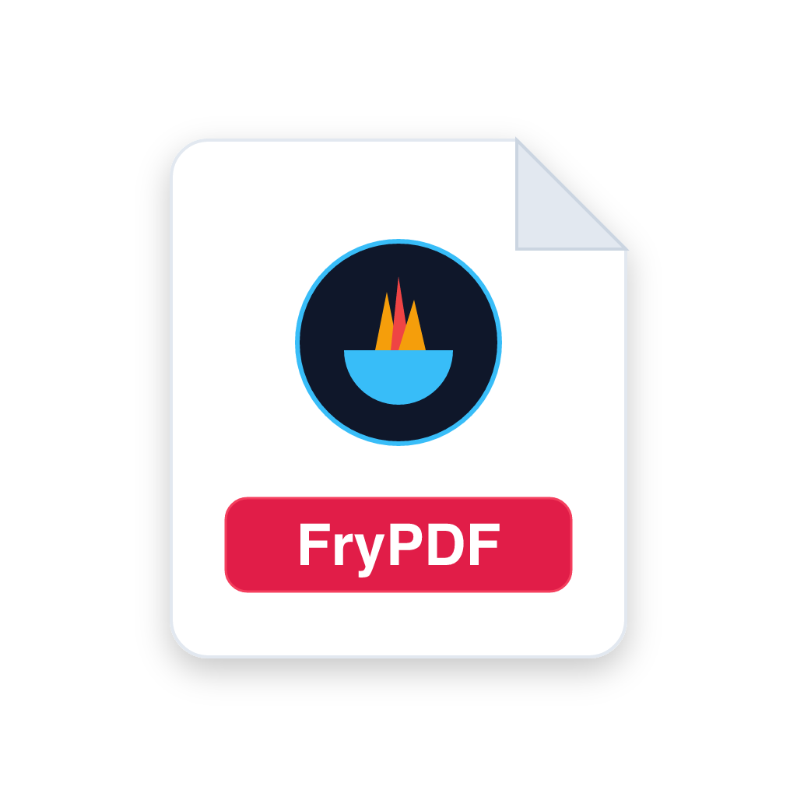

# FryPDF — Modern Desktop PDF Studio

<div align="center">



**A privacy-first, professional desktop PDF creator and editor studio built with Avalonia UI & QuestPDF.**

[](https://dotnet.microsoft.com/)
[](https://avaloniaui.net/)
[](https://www.questpdf.com/)
[](https://github.com)
[](tests/PdfEditorApp.Tests)

</div>

---

- 📕 **Dedicated PDF Reader**: Pure reading mode with continuous vertical scroll, single-page fit, and two-page book spreads. Features eye-comfort themes (Daylight, Warm Sepia, Dark Night, High Contrast), real page thumbnails, table of contents/bookmarks tree, live text search with match jumping, review annotations (multi-color highlights, sticky notes, approval stamps), and a 1-click bridge to FryPDF Editor.
- 📖 **Universal PDF File Editing**: Open and deconstruct real-world `.pdf` files into fully editable visual canvas objects (grouped text, fonts, colors, embedded images, and AcroForms) with zero deserialization errors.
- 🎨 **Visual Document Canvas**: Fluid zoom (25%–500%), page margins, smart snap-to-grid, viewport-centered smart placement, multi-element alignment, and layering.
- 📝 **Interactive AcroForms**: Text fields, checkboxes, radio buttons, dropdowns, combo boxes, and signature boxes with real-time formula recalculation and validation.
- 🖋️ **Signature Studio**: Type-to-sign with 4 cursive calligraphy styles or draw custom vector signatures with smooth bezier curves.
- 📊 **13 Dynamic Chart Types**: Horizontal Bar, Column, Line, Smooth Curve, Area, Donut, Pie, Radar, Scatter, Bubble, Candlestick, Waterfall, and Polar charts.
- 📐 **20+ Vector Shapes & Drawing**: Rectangles, pills, speech callouts, stars, arrows, measurement tool (pt/mm/cm/in), and freehand ink pen.
- 🔢 **Legal Bates Numbering**: Automated sequential page numbering with customizable prefixes, suffixes, digit padding, and 6-anchor positioning.
- 🛡️ **Security & Redaction**: AES-256 password protection, permission flags (copy/print prevention), and permanent pattern-based search-and-redact with FOIA exemption codes.
- 🔍 **Preflight & Accessibility Audit**: Built-in document health scanner checking for low contrast, missing alt text, unflattened form fields, and security vulnerabilities.
- ⚖️ **Document Diff & Comparison**: Side-by-side revision analyzer highlighting added, removed, and modified elements between project versions.
- 📄 **Template Gallery & Community Registry**: Built-in templates for Executive Resumes, Annual Reports, Invoices, Certificates, and Academic Papers.
- 💾 **Dual-Format Persistence**: Native `.frypdf` JSON-based project files & standard binary `.pdf` documents.

---

## 📁 Repository Structure

```
PDFCreator/
├── src/
│   └── PdfEditorApp/             # Main Avalonia desktop application
│       ├── Assets/               # Embedded icons, fonts, templates
│       ├── Converters/           # XAML binding converters
│       ├── Models/               # Domain models & document state
│       ├── Services/             # Export engine, audit, persistence, undo/redo
│       ├── Styles/               # Theme palettes and UI styling
│       ├── Templates/            # Starter document templates
│       ├── ViewModels/           # Reactive MVVM ViewModels
│       └── Views/                # Avalonia XAML Windows, Views, and Dialogs
├── tests/
│   └── PdfEditorApp.Tests/       # Unit and integration test suite (xUnit)
├── docs/
│   ├── ARCHITECTURE.md           # Architecture, MVVM design, and services
│   ├── FEATURES.md               # Detailed feature catalog
│   └── CONTRIBUTING.md           # Developer guidelines and setup
├── packaging/
│   ├── macos/                    # macOS bundle templates & DMG creator
│   └── windows/                  # Inno Setup installer & MSIX packaging
├── .github/workflows/            # GitHub Actions CI/CD release workflows
├── PdfEditorApp.slnx             # Visual Studio / Rider solution file
├── run                           # Quick CLI runner script (./run)
└── watch                         # Quick CLI hot-reload script (./watch)
```

---

## 🚀 Quick Start

### Prerequisites
- [.NET 10 SDK](https://dotnet.microsoft.com/download/dotnet/10.0)

### Running the Application

Using root helper scripts:
```bash
# Run application
./run

# Run with hot reload
./watch
```

Or using `dotnet` CLI directly:
```bash
dotnet run --project src/PdfEditorApp
```

### Running Tests

```bash
dotnet test
```

### Building for Release

```bash
dotnet build -c Release
```

---

## 📦 Packaging & Installers

- **macOS**: Bundled into standalone `FryPDF.app` and `.dmg` installer with universal / Apple Silicon support.
- **Windows**: Packaged via **Inno Setup** (`FryPDF-Setup.exe`) and signed **MSIX** package with `.frypdf` file associations.

---

## 📚 Documentation

- [Architecture & Technical Design](docs/ARCHITECTURE.md)
- [Feature Catalog & Capabilities](docs/FEATURES.md)
- [Contributing Guide](docs/CONTRIBUTING.md)

---

## 📄 License & Credits

Copyright © 2026 **Code Fry Dev**. All rights reserved.
Developed with ❤️ using Avalonia UI and QuestPDF.
