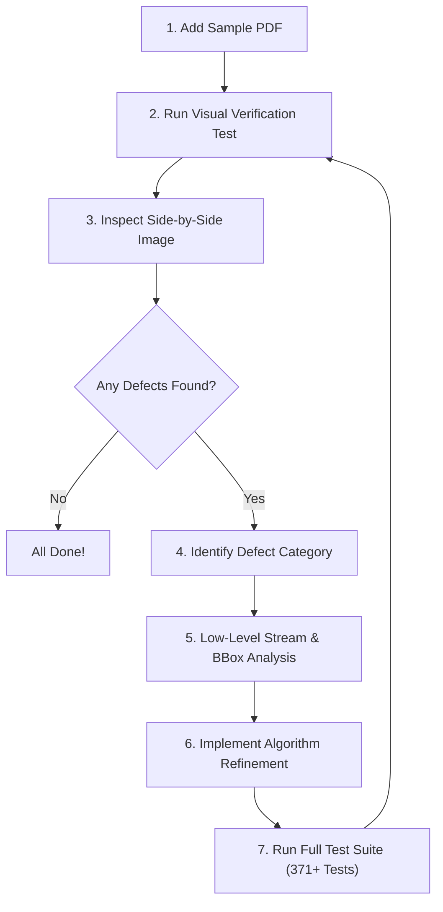

# PDF Deconstruction & Editing Engine Guide

This document explains the architecture, low-level algorithms, and continuous improvement workflow for the **FryPDF Deconstruction & Layout Analysis Engine**.

---

## 1. Overview & Core Philosophy

When a user opens an existing PDF in FryPDF for editing, the application must transform static, flattened PDF streams (text drawing operators, raw image dictionaries, and vector path drawing commands) into a **live, fully editable, structured document model (`PdfDocumentModel`)**.

### Three Import Pathways

```
                                  [ Open PDF File ]
                                         │
                 ┌───────────────────────┴───────────────────────┐
                 ▼                                               ▼
     [ FryPDF Native Document? ]                     [ 3rd-Party External PDF ]
      (Contains Embedded JSON)                                   │
                 │                                               │
                 ▼                                               ▼
     [ 100% Lossless Model ]                     [ PdfDeconstructionEngine ]
     - Exact original elements                                   │
     - Full undo/redo history                                    ▼
     - Live charts, tables, math                ┌────────────────┴────────────────┐
                                                ▼                                 ▼
                                     [ Born-Digital / Mixed ]              [ Scanned / Image-Only ]
                                     - Multi-format Skia images            - Tesseract OCR (if enabled)
                                     - Layered Z-Index architecture        - Page raster image background
                                     - Script-aware text clustering        - Interactive overlay layer
                                     - Vector shapes & divider lines
```

1. **Native FryPDF Roundtrip (100% Lossless)**: If the PDF was authored and exported by FryPDF, embedded metadata restores the exact vector objects, charts, math equations, tables, and form fields losslessly.
2. **Born-Digital / Mixed 3rd-Party PDF**: The deconstruction engine parses text glyphs, vector paths, and embedded raster images, reconstructing them into editable canvas elements with structured layering.
3. **Scanned / Raster-Only PDF**: When no text or vector operators exist, the engine loads the page raster image cleanly as an editable image layer, enabling OCR text overlay and annotations.

---

## 2. What We Built: Low-Level Architecture & Key Discoveries

### A. Layered Z-Index Architecture & Vector Occlusion Resolution

#### The Problem Discovered:
In complex PDFs like government ID cards (`sample1.pdf`), the card backing is drawn as a large solid white rectangle path ($503 \times 609\text{ pt}$). In early versions, shapes were extracted after images, causing the white card background to receive a higher Z-index than the citizen photo, QR codes, emblems, and banners. The opaque white shape sat on top of all images, completely concealing them under white paint while text sat on top of the shape, creating the illusion that images were missing.

#### The Solution: Deterministic Layer Partitioning
[`PdfDeconstructionEngine.cs`](file:///Users/codefrydev/Desktop/SourceCode/PDFCreator/src/PdfEditorApp.Core/Deconstruction/PdfDeconstructionEngine.cs) partitions all extracted elements into non-overlapping Z-index layers:

| Layer Range | Elements | Classification Rules |
| :--- | :--- | :--- |
| **`ZIndex = 0..99`** | Background Cards & Watermarks | Shapes with $W \ge 120\text{ pt}$ and $H \ge 80\text{ pt}$, full-page backgrounds, and faint centered watermarks ($W \ge 65\%, H \ge 55\%$) |
| **`ZIndex = 100..499`** | Content Images & Logos | Photos, QR codes, emblems, government banners, icons, and diagrams |
| **`ZIndex = 500..599`** | Structured Tables & Grids | Tabular grid cells, borders, and invoice items |
| **`ZIndex = 600..999`** | Foreground Shapes & Dividers | VID masking glyphs, stamp badges, decorative dividers, small accents |
| **`ZIndex = 1000..1999`** | Text Blocks & Marginalia | Headings, multi-line paragraphs, labels, and rotated vertical text |
| **`ZIndex = 2000+`** | Form Controls & Signatures | Interactive form fields, checkboxes, digital signature widgets |

---

### B. Multi-Format Skia Image Decoder

#### The Problem:
`IPdfImage.TryGetPng(...)` fails on raw DCT (JPEG) streams, JPEG2000, uncompressed CMYK/RGB raw sample streams, and 1-bit monochrome bitmaps, causing embedded images to be discarded.

#### The Solution:
`PdfDeconstructionEngine.ExtractImageBytes` uses a multi-tier decoding pipeline:
1. **PNG Magic Header Check**: Verifies if the stream already starts with `89 50 4E 47 0D 0A 1A 0A`.
2. **SkiaSharp Memory Decoder (`SKBitmap.Decode`)**: Decodes JPEG, WebP, BMP, and JPEG2000 streams and re-encodes them into standardized PNG byte buffers.
3. **Raw Sample Reconstruction**: Handles 24-bit RGB, 8-bit grayscale, and 32-bit CMYK pixel streams by manually mapping pixel strides and color channels to an `SKBitmap` before PNG encoding.

---

### C. Script-Aware Layout & Typography Engine

[`PdfLayoutAnalyzer.cs`](file:///Users/codefrydev/Desktop/SourceCode/PDFCreator/src/PdfEditorApp.Core/Analysis/PdfLayoutAnalyzer.cs) and [`UnicodeScriptDetector.cs`](file:///Users/codefrydev/Desktop/SourceCode/PDFCreator/src/PdfEditorApp.Core/Analysis/UnicodeScriptDetector.cs) implement intelligent text layout analysis:

1. **Script Detection & Font Fallback**:
   - Detects over 30 world scripts (Devanagari, Tamil, Telugu, Arabic, Hebrew, CJK, Cyrillic, Thai, Latin).
   - Maps font names and Unicode ranges to reliable system/embedded font families (e.g. `Noto Sans Devanagari`, `Kohinoor Devanagari`, `PingFang SC`, `Noto Sans SC`) to prevent tofu boxes (`□□□`).

2. **Complex Script Word Joining**:
   - In Indic and complex scripts, syllables and halant ligatures often produce separate bounding boxes. `BuildLine` evaluates horizontal gaps; sub-threshold gaps are joined without artificial spaces to preserve natural words (e.g. `राकेश कुमार` instead of `राके श कु मार`).

3. **Paragraph Indentation & Clustering**:
   - `ShouldClusterLines` checks vertical pitch ($\le 0.95 \times \text{FontSize}$), font size compatibility, color consistency, and paragraph indentations ($>8\text{ pt}$).
   - Indented lines and list bullets start fresh paragraph blocks, preventing multi-paragraph texts from merging into a single monolithic block.

4. **Relative Line Pitch Multipliers**:
   - `LineHeight` is computed as a proportional ratio ($1.25\times$ to $1.4\times\text{FontSize}$) rather than absolute pixel offsets, ensuring text does not squash across different screen DPIs.

---

### D. Automated Side-by-Side Visual Verification System

Located in [`PdfImportAndViewerTests.cs`](file:///Users/codefrydev/Desktop/SourceCode/PDFCreator/tests/PdfEditorApp.Tests/PdfImportAndViewerTests.cs):
- **Ground Truth Rasterizer**: Uses PdfPig + SkiaSharp to render the true raw PDF page.
- **Model Rasterizer**: Renders the deconstructed `PdfPageModel` (all extracted images, shapes, dividers, and text elements).
- **Comparison Output**: Stitches both renderings side by side onto a high-resolution canvas with element counts, saving artifacts (e.g. `sample1_side_by_side.png`, `sample2_side_by_side.png`) for instant visual auditing.

---

## 3. Continuous Improvement Guide: How to Handle New PDF Types

As new and diverse PDF documents are tested in FryPDF (tax forms, bank statements, multi-column scientific journals, CAD blueprints, certificates, foreign language documents), follow this systematic 7-step process:



### Step 1: Add the Sample PDF
Place the new test PDF in the repository root or in `tests/PdfEditorApp.Tests/` (e.g., `invoice_sample.pdf`, `research_paper.pdf`).

### Step 2: Register & Run the Visual Verification Test
In `PdfImportAndViewerTests.cs`, add the sample file path to `GenerateVisualComparison_SideBySide_SavesArtifacts`:
```csharp
string newSamplePath = Path.Combine(rootDir, "my_new_sample.pdf");
if (File.Exists(newSamplePath))
{
    await GenerateComparisonForPdf(newSamplePath, Path.Combine(artifactDir, "my_sample_side_by_side.png"), "New Sample Document");
}
```
Run the test from terminal:
```bash
dotnet test --filter "FullyQualifiedName~GenerateVisualComparison_SideBySide"
```

### Step 3: Inspect the Generated Side-by-Side Artifact
Open the generated PNG in the artifact directory. Perform the **Visual Audit Checklist**:

| Item | What to Check | Potential Cause if Defective |
| :--- | :--- | :--- |
| **Images** | Are photos, QR codes, or logos missing? | Check Z-index layer or Skia image decoding format. |
| **Opacity** | Are content cards or tables faint/dimmed? | Watermark classification threshold was too broad. |
| **Typography** | Are characters rendering as tofu boxes `□□□`? | Script detector or font fallback needs the script family added. |
| **Line Pitch** | Is text squashed or overlapping vertically? | Line height multiplier or vertical pitch in `PdfLayoutAnalyzer`. |
| **Columns** | Did two separate columns merge into one line? | `columnGapMultiplier` or `maxColGap` in `ExtractLinesFromWords`. |
| **Badges / Numbers** | Did badge text merge with adjacent titles? | Cap `baseGap` in `ExtractLinesFromWords`. |
| **Rotated Text** | Is vertical text positioned or rotated incorrectly? | Check `Rotation` angle (90° vs 270°) and center pivot math. |

### Step 4: Low-Level Stream & Object Inspection
If an anomaly is spotted, run `DeconstructSampleFiles_Investigate` with detailed logging to inspect raw element properties:
- Bounding boxes `(Left, Bottom, Width, Height)`
- Color hex values and fill vs stroke flags
- Font name strings from PDF dictionary
- Rotation angles

### Step 5: Implement Algorithmic Refinement
Refine the corresponding component:
- **Image handling**: [`PdfDeconstructionEngine.cs`](file:///Users/codefrydev/Desktop/SourceCode/PDFCreator/src/PdfEditorApp.Core/Deconstruction/PdfDeconstructionEngine.cs) -> `ExtractImageBytes` or Z-index assignment.
- **Shape classification**: [`PdfDeconstructionEngine.cs`](file:///Users/codefrydev/Desktop/SourceCode/PDFCreator/src/PdfEditorApp.Core/Deconstruction/PdfDeconstructionEngine.cs) -> Container shape heuristic ($W \ge 120, H \ge 80$).
- **Word/Paragraph clustering**: [`PdfLayoutAnalyzer.cs`](file:///Users/codefrydev/Desktop/SourceCode/PDFCreator/src/PdfEditorApp.Core/Analysis/PdfLayoutAnalyzer.cs) -> `ExtractLinesFromWords` or `ShouldClusterLines`.
- **Script/Font matching**: [`UnicodeScriptDetector.cs`](file:///Users/codefrydev/Desktop/SourceCode/PDFCreator/src/PdfEditorApp.Core/Analysis/UnicodeScriptDetector.cs) -> `ClassifyCodepoint` and `ScriptToFontFamily`.

### Step 6: Validate Against Regressions
Run the full test suite across the solution:
```bash
dotnet test
```
**Rule**: All 371+ unit tests must pass. No existing document type (e-Aadhaar, textbook, annual report, invoice) may regress when a new document scenario is added.

### Step 7: Verify the Updated Side-by-Side Comparison
Re-run the visual verification test and confirm that both Left (Ground Truth) and Right (Deconstructed Canvas) are visually indistinguishable.

---

## 4. Key Heuristics & Constants Reference

For quick reference when tuning algorithms in future development:

```csharp
// --- Watermark Detection Thresholds (PdfDeconstructionEngine.cs) ---
bool isFullPageBg = imgW >= pageWidth * 0.88 && imgH >= pageHeight * 0.88 && hasSufficientText;
bool isWatermark = (imgW >= pageWidth * 0.65 && imgH >= pageHeight * 0.55) && hasSufficientText;

// --- Background Container Shape Thresholds (PdfDeconstructionEngine.cs) ---
bool isContainerShape = (shpW >= 120.0 && shpH >= 80.0) || (shpW >= pageWidth * 0.40 && shpH >= 60.0);

// --- Column & Badge Gap Thresholds (PdfLayoutAnalyzer.cs) ---
double baseGap = Math.Max(16.0, Math.Min(30.0, wordHeight * 1.1));
double maxColGap = baseGap * Math.Max(0.5, columnGapMultiplier);

// --- Paragraph Line Pitch & Indentation (PdfLayoutAnalyzer.cs) ---
double expectedLineGap = Math.Max(7.0, prev.FontSize * 0.95);
bool isIndented = next.Left > prev.Left + 8.0; // Starts a new paragraph
```
