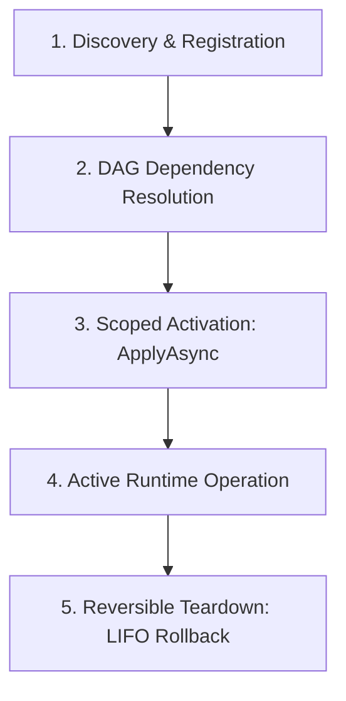

# How "Everything is a Plugin" Works in FryPDF

> **The Definitive Developer Guide to FryPDF's Microkernel Architecture**  
> *Target Audience: Any developer joining the FryPDF project or building extensions for it.*

---

## 1. The 30-Second Mental Model: The Operating System Analogy

If you have worked on typical desktop applications, you are probably used to seeing code like this:

```csharp
// ❌ The Traditional "Monolithic" Way
public void OpenTool(ToolType tool)
{
    switch (tool)
    {
        case ToolType.Merge: new MergeDialog().Show(); break;
        case ToolType.Split: new SplitDialog().Show(); break;
        case ToolType.Compress: new CompressDialog().Show(); break;
        // Adding a new tool means editing 10 different files, enums, and switch statements!
    }
}
```

In **FryPDF**, we do **not** do this. 

Instead, FryPDF is designed like an **Operating System Kernel** (inspired by the **Cordis** spatiotemporal composability framework):

* **The Core App is just a Host**: The main application shell provides a window, a theme engine, and a plugin host. It does not know or care what individual tools or buttons exist.
* **Even Built-In Features are Plugins**: "Merge PDF", "Compress PDF", "Page Thumbnails Sidebar", "Status Bar Memory Monitor", and "AI Summarizer" are **all 100% independent plugins**.
* **Zero Privilege**: Built-in features use the **exact same public APIs** that a third-party community plugin uses.
* **Plug & Play**: You can mount, unmount, hot-reload, or disable any feature at runtime without restarting the app and without leaving dangling memory leaks.

```
┌────────────────────────────────────────────────────────────────────────┐
│                        FryPDF Microkernel Host                         │
│   (Service Bus • Dependency DAG • Effect Rollback • Dispatch Pipelines)│
└───────────────────────────────────┬────────────────────────────────────┘
                                    │
       ┌────────────────────────────┼────────────────────────────┐
       ▼                            ▼                            ▼
┌──────────────┐             ┌──────────────┐             ┌──────────────┐
│  Built-in    │             │  Built-in    │             │ Third-Party  │
│  Merge Tool  │             │ Thumbnail Bar│             │ Custom Tool  │
│   (Plugin)   │             │   (Plugin)   │             │   (Plugin)   │
└──────────────┘             └──────────────┘             └──────────────┘
```

---

## 2. The Core Anatomy of a Plugin

Every capability in FryPDF implements the [IFryPlugin](file:///Users/codefrydev/Desktop/SourceCode/PDFCreator/src/PdfEditorApp.Core/Plugins/IFryPlugin.cs) interface (or inherits from [ToolPluginBase](file:///Users/codefrydev/Desktop/SourceCode/PDFCreator/src/PdfEditorApp/Plugins/ToolPluginBase.cs) for tools):

```csharp
namespace PdfEditorApp.Core.Plugins;

public interface IFryPlugin
{
    string Id { get; }                                            // Unique ID: "frypdf.tool.merge"
    string Name { get; }                                          // User-friendly name: "Merge PDF"
    Version Version { get; }                                      // Semantic version: 1.0.0
    
    IReadOnlyList<Type> RequiredServices { get; }                 // Dependencies needed to boot
    IReadOnlyList<Type> ProvidedServices => Array.Empty<Type>();  // Capabilities this plugin offers
    
    IReadOnlyDictionary<string, PluginSettingDefinition>? SettingsSchema => null; // Auto-generated UI settings
    
    Task ApplyAsync(IFryPluginContext ctx, CancellationToken ct = default);       // Activation hook
}
```

### The 3 Core Responsibilities:
1. **Declare Identity & Dependencies**: State who you are (`Id`, `Name`) and what services you need (`RequiredServices`) before you can run.
2. **Mount Capabilities (`ApplyAsync`)**: Register your tools, ribbon buttons, sidebar tabs, canvas elements, or background services into the provided [IFryPluginContext](file:///Users/codefrydev/Desktop/SourceCode/PDFCreator/src/PdfEditorApp.Core/Plugins/IFryPluginContext.cs).
3. **Register Cleanup (`ctx.RegisterEffect`)**: Any event listener, timer, or unmanaged resource you allocate must be registered for automatic rollback.

---

## 3. The 5-Phase Lifecycle: What Happens Behind the Scenes

When FryPDF launches or when a user installs a plugin, the [PluginHost](file:///Users/codefrydev/Desktop/SourceCode/PDFCreator/src/PdfEditorApp.Core/Plugins/PluginHost.cs) manages each plugin through 5 distinct phases:



### Phase 1: Registration (`RegisterPlugin`)
The plugin is added to the host's registry. At this point, the code is loaded, but nothing is running or taking up active canvas/UI slots.

### Phase 2: Directed Acyclic Graph (DAG) Resolution
Plugins can depend on other plugins or core services. For example, a `WordToPdfPlugin` might depend on `IPdfRendererService`.
- The [PluginHost](file:///Users/codefrydev/Desktop/SourceCode/PDFCreator/src/PdfEditorApp.Core/Plugins/PluginHost.cs) analyzes `RequiredServices` and `ProvidedServices`.
- It performs a **topological sort**.
- If a dependency is missing, it skips or raises a clean [PluginMissingDependencyException](file:///Users/codefrydev/Desktop/SourceCode/PDFCreator/src/PdfEditorApp.Core/Plugins/PluginExceptions.cs).
- If there is a cycle (A needs B, and B needs A), it catches the [PluginCircularDependencyException](file:///Users/codefrydev/Desktop/SourceCode/PDFCreator/src/PdfEditorApp.Core/Plugins/PluginExceptions.cs) safely without crashing.

### Phase 3: Scoped Activation (`ApplyAsync`)
The kernel creates an isolated [PluginScope](file:///Users/codefrydev/Desktop/SourceCode/PDFCreator/src/PdfEditorApp.Core/Plugins/PluginScope.cs) and passes a scoped [IFryPluginContext](file:///Users/codefrydev/Desktop/SourceCode/PDFCreator/src/PdfEditorApp.Core/Plugins/IFryPluginContext.cs) to your plugin:
```csharp
PluginScope scope = new();
var scopedContext = _context.CreateScopedContext(scope);
await plugin.ApplyAsync(scopedContext, ct);
```
**Every single tool, button, sidebar tab, or pipeline hook** you register through `scopedContext` is automatically bound to that `scope`.

### Phase 4: Active Runtime Operation
Your plugin is now live! 
- Its tools appear in the Home view.
- Its buttons show up in the top Ribbon.
- Its sidebar tabs appear in the document editor.
- Its pipelines intercept file exports or conversions.

### Phase 5: Reversible Teardown (LIFO Rollback)
When a user toggles a plugin off in settings or uninstalls it:
1. `scope.Dispose()` is called.
2. Every effect registered during `ApplyAsync` is popped off the stack in **Last-In, First-Out (LIFO)** order.
3. Ribbon buttons detach, sidebar tabs close, tool cards vanish from the dashboard, and unmanaged bitmaps or event listeners are disposed.
4. **Result**: Zero memory leaks, zero dangling event listeners, and no need to restart the app!

---

## 4. The 12 Dynamic Capability Pillars (Where Can You Plug In?)

Where in FryPDF can your plugin extend? We have **12 dynamic registries** exposed directly on [IFryPluginContext](file:///Users/codefrydev/Desktop/SourceCode/PDFCreator/src/PdfEditorApp.Core/Plugins/IFryPluginContext.cs):

| # | Extension Point | Context Registration Method | What It Lets You Do |
|---|---|---|---|
| **1** | **PDF Tools** | `ctx.RegisterTool(descriptor)` | Add a new tool card to the Home grid (e.g. Merge, Compress, Rotate). |
| **2** | **Ribbon Bar** | `ctx.RegisterRibbonTab(...)`<br/>`ctx.RegisterRibbonGroup(...)`<br/>`ctx.RegisterRibbonAction(...)` | Add custom tabs, tool groups, or action pill buttons into the top M3 Ribbon. |
| **3** | **Editor Sidebars** | `ctx.RegisterSidebarTab(descriptor)` | Add a left/right panel tab (e.g. Thumbnails, Outline, Comments, AI Chat). |
| **4** | **Contextual Inspector** | `ctx.RegisterInspectorSection(descriptor)` | Add custom property panels when an element on the canvas is selected. |
| **5** | **Workspace Pages** | `ctx.RegisterNavigationItem(descriptor)` | Add a full-viewport studio or page to the main navigation rail (e.g. Logs, Batch Studio). |
| **6** | **Canvas Elements** | `ctx.RegisterCanvasElement(descriptor)` | Add new interactive draggable items to PDF pages (e.g. Barcodes, LaTeX math, Sticky notes). |
| **7** | **Document Importers** | `ctx.RegisterImporter(importer)` | Ingest non-PDF formats (Word, Markdown, HTML, Excel) into editable PDF documents. |
| **8** | **Document Exporters** | `ctx.RegisterExporter(exporter)` | Export documents to external formats (PDF/A, multi-page TIFF, PNG sequences). |
| **9** | **AI Providers** | `ctx.RegisterService<IAiProvider>(impl)` | Hook up LLMs (Local Ollama, Groq, OpenAI, Anthropic) for summarization and translation. |
| **10**| **OCR Engines** | `ctx.RegisterOcrEngine(engine)` | Provide optical character recognition (Tesseract, Apple Vision, Windows Media OCR). |
| **11**| **Data Connectors** | `ctx.RegisterDataConnector(connector)` | Pull external tabular data (CSV, XLSX, SQL, REST APIs) for bulk document generation. |
| **12**| **Status Bar, Overlays & Dialogs** | `ctx.RegisterStatusBarWidget(...)`<br/>`ctx.RegisterOverlay(...)`<br/>`ctx.RegisterCommand(...)`<br/>`ctx.RegisterDialog(...)` | Add footer status pills, floating non-modal windows, Command Palette (⌘K) actions, and modal dialogs. |

---

## 5. The 5 Typed Dispatch Pipelines (How Plugins Communicate)

In a monolithic app, components call each other with tightly-coupled concrete methods. In FryPDF, plugins communicate through **5 Cordis-inspired typed dispatch pipelines**:

```
1. Waterfall  ──► [Plugin A] ──► [Plugin B] ──► [Core Action] ──► [Plugin B] ──► [Plugin A]  (Around-Middleware)
2. Bail       ──► [Plugin A (No)] ──► [Plugin B (Handled!)] ──► Short-circuit!              (First to handle)
3. Parallel   ──► [Plugin A] & [Plugin B] & [Plugin C] run simultaneously via Task.WhenAll  (Concurrent broadcast)
4. Serial     ──► [Plugin A] then [Plugin B] then [Plugin C] run in order                   (Sequential validation)
5. Emit       ──► Fire-and-forget notification across decoupled ViewModels
```

### 1. Waterfall Pipeline (Around-Middleware)
Great for operations that wrap or intercept a process, such as **PDF Export**:
```csharp
ctx.RegisterWaterfall<PdfExportContext>("pdf:export", async (context, next) =>
{
    // Pre-processing: e.g. Add watermark stamp
    context.Document.Metadata.Title += " [Processed by MyPlugin]";
    
    // Call the next plugin in the chain (or the core QuestPDF exporter)
    await next();
    
    // Post-processing: e.g. Log file size or encrypt bytes
    Console.WriteLine($"Export finished! File size: {context.TargetStream.Length} bytes");
});
```

### 2. Bail Pipeline (First Handled Result)
Great for format converters or OCR engines. The pipeline stops as soon as a plugin returns a non-null result:
```csharp
ctx.RegisterBail<FileConversionRequest, Stream>("convert:to_pdf", async request =>
{
    if (!request.SourceFilePath.EndsWith(".xyz", StringComparison.OrdinalIgnoreCase))
    {
        return null; // I don't know how to convert .xyz, pass to next plugin!
    }

    return await ConvertXyzToPdfStreamAsync(request.SourceFilePath);
});
```

### 3. Parallel Pipeline (Concurrent Notification)
Great for broadcasting events where plugins don't depend on each other:
```csharp
ctx.RegisterParallel<DocumentOpenedEvent>("document:opened", async evt =>
{
    await SendAnalyticsPingAsync(evt.DocumentId);
});
```

### 4. Serial Pipeline (Sequential Execution)
Great for validation or security checks that must run one after another:
```csharp
ctx.RegisterSerial<PreExportValidationContext>("pdf:validate", async ctx =>
{
    if (ctx.PageCount > 500)
    {
        ctx.Warnings.Add("Document exceeds recommended page limits.");
    }
});
```

---

## 6. Hands-On Walkthrough: Creating a Real Plugin

Let's walk through building a complete, realistic plugin: **A "Quick Watermark" Plugin**.

This plugin will:
1. Add an action button to the **Ribbon** (`Edit` tab).
2. Add a status indicator to the **Status Bar** footer.
3. Expose a **Settings Schema** so users can customize the watermark text in M3 UI without writing any XAML!

```csharp
using System;
using System.Collections.Generic;
using System.Threading;
using System.Threading.Tasks;
using CommunityToolkit.Mvvm.Messaging;
using PdfEditorApp.Core.Plugins;
using PdfEditorApp.Core.Plugins.Descriptors;
using PdfEditorApp.Core.Plugins.Manifests;

namespace MyCustomPlugins;

public class QuickWatermarkPlugin : IFryPlugin
{
    // 1. Identity
    public string Id => "com.example.quickwatermark";
    public string Name => "Quick Watermark";
    public Version Version => new(1, 0, 0);

    // 2. Dependencies (None required for this simple plugin)
    public IReadOnlyList<Type> RequiredServices => Array.Empty<Type>();

    // 3. Declarative Settings Schema: FryPDF auto-generates the M3 settings UI for this!
    public IReadOnlyDictionary<string, PluginSettingDefinition>? SettingsSchema => new Dictionary<string, PluginSettingDefinition>
    {
        ["WatermarkText"] = new()
        {
            Key = "WatermarkText",
            Label = "Watermark Text",
            Description = "The default text stamped across all pages",
            Type = PluginSettingType.String,
            DefaultValue = "CONFIDENTIAL"
        },
        ["StampOnExport"] = new()
        {
            Key = "StampOnExport",
            Label = "Auto-Stamp on Export",
            Description = "Automatically apply the watermark when saving or exporting",
            Type = PluginSettingType.Boolean,
            DefaultValue = true
        }
    };

    // 4. Activation Hook
    public Task ApplyAsync(IFryPluginContext ctx, CancellationToken ct = default)
    {
        // A. Register a button in the top Ribbon Bar
        ctx.RegisterRibbonAction(new RibbonActionDescriptor
        {
            ActionId = "quickwatermark.apply",
            TabId = "Edit",
            GroupId = "Stamps",
            Label = "Stamp Confidential",
            IconKind = "Watermark",
            ToolTip = "Stamp CONFIDENTIAL diagonally across the active document",
            Command = new CommunityToolkit.Mvvm.Input.RelayCommand(() =>
            {
                ApplyWatermarkToActiveDocument();
            })
        });

        // B. Register a widget in the Status Bar footer
        ctx.RegisterStatusBarWidget(new StatusBarWidgetDescriptor
        {
            WidgetId = "quickwatermark.status",
            Alignment = StatusBarAlignment.Right,
            Order = 50,
            ToolTip = "Quick Watermark Active",
            Factory = sp => new ViewModels.StatusBarWidgetViewModel
            {
                WidgetId = "quickwatermark.status",
                Label = "Watermark Ready",
                IconKind = "ShieldCheckOutline",
                IsActive = true
            }
        });

        // C. Clean up any custom event subscriptions via Reversible Effects
        // Any effect registered here will be run if the user disables this plugin!
        ctx.RegisterEffect(() =>
        {
            Console.WriteLine("Quick Watermark plugin cleanly unloaded!");
        });

        return Task.CompletedTask;
    }

    private void ApplyWatermarkToActiveDocument()
    {
        // Business logic here...
    }
}
```

### Notice what we DID NOT have to do:
- ❌ We did NOT modify `MainWindow.axaml` to add the button.
- ❌ We did NOT add an enum value to `RibbonActionType`.
- ❌ We did NOT write a custom Settings dialog view in XAML.
- ❌ We did NOT write manual unhooking boilerplate for the ribbon button.

Everything was dynamic, declarative, and 100% reversible.

---

## 7. Declarative Settings: Zero-Boilerplate UI

When a plugin exposes `SettingsSchema`, FryPDF's **Plugin Settings Dialog** dynamically creates a **Google Material Design 3 (M3) Expressive** configurator for it automatically:

```csharp
public IReadOnlyDictionary<string, PluginSettingDefinition>? SettingsSchema => new Dictionary<string, PluginSettingDefinition>
{
    // Renders an M3 outlined TextBox
    ["ServerUrl"] = new() { Key = "ServerUrl", Label = "Server Endpoint", Type = PluginSettingType.String },

    // Renders an M3 password-masked TextBox
    ["ApiKey"] = new() { Key = "ApiKey", Label = "API Secret", Type = PluginSettingType.Secret, IsRequired = true },

    // Renders an M3 tactile ToggleSwitch
    ["EnableHpu"] = new() { Key = "EnableHpu", Label = "Hardware Acceleration", Type = PluginSettingType.Boolean, DefaultValue = true },

    // Renders an M3 NumericUpDown
    ["TimeoutSec"] = new() { Key = "TimeoutSec", Label = "Timeout (Seconds)", Type = PluginSettingType.Number, DefaultValue = 30 },

    // Renders an M3 ComboBox
    ["Quality"] = new() { Key = "Quality", Label = "Render Quality", Type = PluginSettingType.Select, Options = ["Draft", "Standard", "HighRes"] }
};
```

All values are automatically saved to `~/.frypdf/plugin_settings.json` and persist across application restarts.

---

## 8. Built-in Bundles vs. External `.fryplugin` Packages

FryPDF plugins come in two flavors, but share the exact same runtime engine:

### 1. Built-in Bundles (`IFryPluginBundle`)
Internal features are grouped into **Bundles** located in [src/PdfEditorApp/Plugins/Bundles/](file:///Users/codefrydev/Desktop/SourceCode/PDFCreator/src/PdfEditorApp/Plugins/Bundles):
- [ToolsOrganizeBundle.cs](file:///Users/codefrydev/Desktop/SourceCode/PDFCreator/src/PdfEditorApp/Plugins/Bundles/ToolsOrganizeBundle.cs) (Merge, Split, Rotate, Crop)
- [ToolsSecurityBundle.cs](file:///Users/codefrydev/Desktop/SourceCode/PDFCreator/src/PdfEditorApp/Plugins/Bundles/ToolsSecurityBundle.cs) (Compress, Protect, Unlock, Redact)
- [EditorSidebarsBundle.cs](file:///Users/codefrydev/Desktop/SourceCode/PDFCreator/src/PdfEditorApp/Plugins/Bundles/EditorSidebarsBundle.cs) (Thumbnails, Outline, Comments)
- [StatusBarBundle.cs](file:///Users/codefrydev/Desktop/SourceCode/PDFCreator/src/PdfEditorApp/Plugins/Bundles/StatusBarBundle.cs) (Memory monitor, Page stats, Status)
- [AiProvidersBundle.cs](file:///Users/codefrydev/Desktop/SourceCode/PDFCreator/src/PdfEditorApp/Plugins/Bundles/AiProvidersBundle.cs) (Ollama, OpenAI, Groq)

Bundles allow FryPDF to compile different **Application Profiles**:
- `desktop.profile.json` loads all GUI bundles + Avalonia UI.
- `headless.profile.json` loads only the Core engines and CLI tools (zero UI overhead).

### 2. External `.fryplugin` Packages
Community and third-party plugins are distributed as a single `.fryplugin` file (a standard ZIP file containing `plugin.json` and compiled `.dll` assemblies).
- Users install them by simply **dragging and dropping** the file onto FryPDF's Plugins Dialog.
- The app loads the DLL into an isolated, collectible `AssemblyLoadContext`.
- **Zero Restart**: The plugin activates immediately.

> 📖 *For a complete guide to creating and packaging external plugins with MSBuild, see the [External Plugin Development Guide](file:///Users/codefrydev/Desktop/SourceCode/PDFCreator/docs/EXTERNAL_PLUGIN_DEVELOPMENT_GUIDE.md) and the [Tic-Tac-Toe Plugin Example](file:///Users/codefrydev/Desktop/SourceCode/PDFCreator/docs/TIC_TAC_TOE_EXAMPLE.md).*

---

## 9. The Developer Golden Rules (Must-Follow!)

When contributing to FryPDF or writing plugins, you **MUST** follow these core engineering mandates:

### 1. Never Write Monolithic Switches
- ❌ **Wrong**: Adding a new tool by adding an enum to `PdfToolId` and writing a `switch` statement in `MainViewModel`.
- ✅ **Right**: Create a new class inheriting [ToolPluginBase](file:///Users/codefrydev/Desktop/SourceCode/PDFCreator/src/PdfEditorApp/Plugins/ToolPluginBase.cs) and add it to a bundle or register it via `ctx.RegisterTool()`.

### 2. Always Register Reversible Effects
- ❌ **Wrong**: Subscribing to an event `SomeService.OnEvent += HandleEvent;` in `ApplyAsync` without unhooking.
- ✅ **Right**: Use `ctx.RegisterEffect(() => SomeService.OnEvent -= HandleEvent);` or use `WeakReferenceMessenger.Default`.

### 3. Strictly Adhere to Material Design 3 (M3) Expressive
- Use standard M3 shapes:
  - Pills (`CornerRadius="{StaticResource M3ShapeCornerFull}"` or `9999`) for all buttons and chips.
  - Large cards (`CornerRadius="{StaticResource M3ShapeCornerLarge}"` or `16`) for cards and inspector panels.
  - Extra Large (`CornerRadius="{StaticResource M3ShapeCornerExtraLarge}"` or `28`) for dialogs.
- Never hardcode hex colors (`#FFFFFF`). Always use dynamic brushes (`{DynamicResource M3SurfaceBrush}`, `{DynamicResource M3PrimaryBrush}`).

### 4. Zero UI Thread Blocking (60+ FPS Mandate)
- Never run Skia rendering, PDF parsing, or file I/O on the UI thread.
- Never call `.Result`, `.Wait()`, or `.GetAwaiter().GetResult()`.
- Always use asynchronous commands with `Task.Run` and `CancellationToken`.

---

## 10. Quick Reference & Cheat Sheet

| I want to... | What to do: |
|---|---|
| **Add a new PDF operation (e.g. Invert Colors)** | Inherit [ToolPluginBase](file:///Users/codefrydev/Desktop/SourceCode/PDFCreator/src/PdfEditorApp/Plugins/ToolPluginBase.cs), implement `CreateDescriptor()`, and add to [ToolsOrganizeBundle.cs](file:///Users/codefrydev/Desktop/SourceCode/PDFCreator/src/PdfEditorApp/Plugins/Bundles/ToolsOrganizeBundle.cs). |
| **Add a button to the top Ribbon** | Call `ctx.RegisterRibbonAction(...)` inside `ApplyAsync`. |
| **Add a tab to the editor sidebar** | Call `ctx.RegisterSidebarTab(...)` inside `ApplyAsync`. |
| **Add a property section when an element is selected** | Call `ctx.RegisterInspectorSection(...)` inside `ApplyAsync`. |
| **Add a floating interactive overlay or mini-app** | Call `ctx.RegisterOverlay(...)` (see [Tic-Tac-Toe Example](file:///Users/codefrydev/Desktop/SourceCode/PDFCreator/docs/TIC_TAC_TOE_EXAMPLE.md)). |
| **Intercept document export** | Call `ctx.RegisterWaterfall<PdfExportContext>("pdf:export", ...)` inside `ApplyAsync`. |
| **Add user-configurable settings** | Implement the `SettingsSchema` property on your plugin class. |

---

## 11. Further Reading

- [PLUGIN_BASED_ARCHITECTURE.md](file:///Users/codefrydev/Desktop/SourceCode/PDFCreator/docs/PLUGIN_BASED_ARCHITECTURE.md) — The complete in-depth architectural specification.
- [EXTERNAL_PLUGIN_DEVELOPMENT_GUIDE.md](file:///Users/codefrydev/Desktop/SourceCode/PDFCreator/docs/EXTERNAL_PLUGIN_DEVELOPMENT_GUIDE.md) — Step-by-step tutorial for building standalone `.fryplugin` extensions.
- [TIC_TAC_TOE_EXAMPLE.md](file:///Users/codefrydev/Desktop/SourceCode/PDFCreator/docs/TIC_TAC_TOE_EXAMPLE.md) — Complete working reference implementation of an interactive floating overlay plugin.
- [MATERIAL_DESIGN_3_EXPRESSIVE_GUIDELINES.md](file:///Users/codefrydev/Desktop/SourceCode/PDFCreator/docs/MATERIAL_DESIGN_3_EXPRESSIVE_GUIDELINES.md) — UI tokens, corner radii, and color roles.
